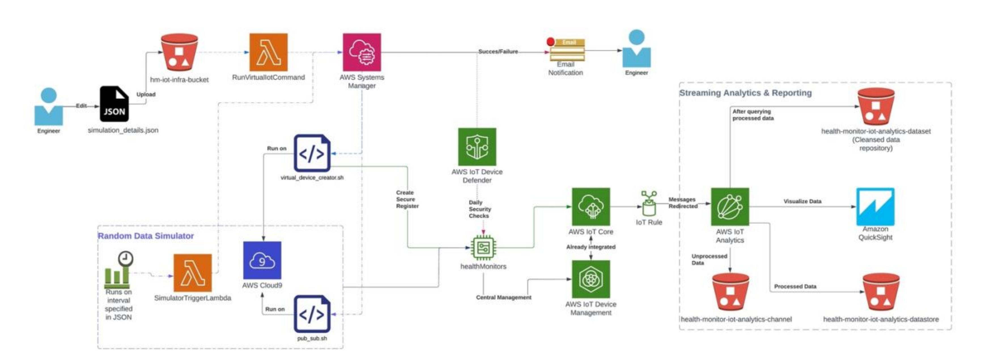
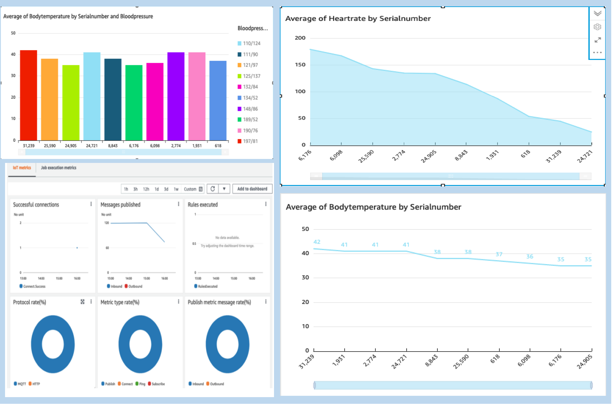
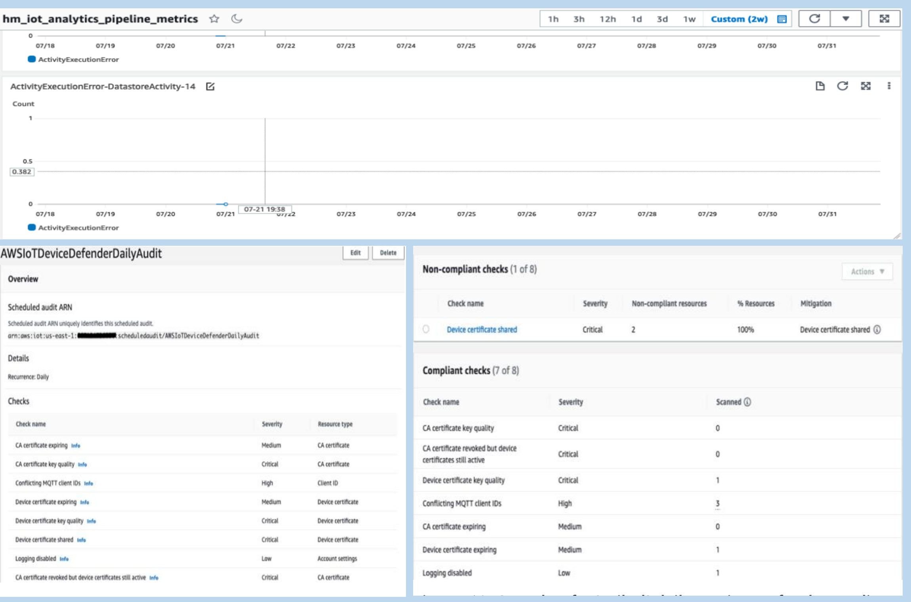
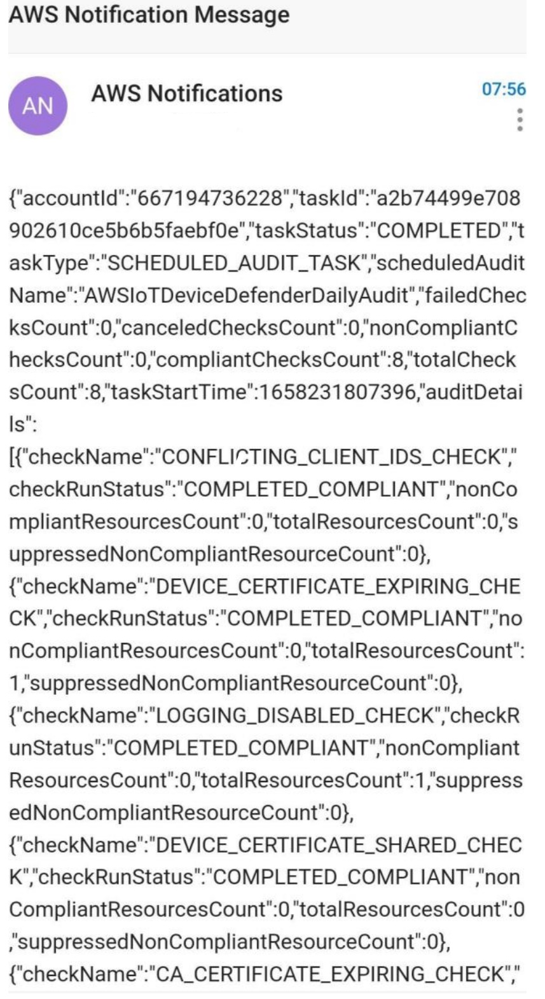

Prototype to Deployment
==============================
<!-- PROJECT LOGO -->
 

  

A cloud native centralized IoT platform for healthcare monitoring.

This project offers a comprehensive cloud solution for simulating, testing, and deploying IoT devices with added capabilities including analytics, reporting, monitoring, auditing, and failure notifications.

Project Organization
-----------

|---readme-assets  
|---README.md  
|---simulation_details.json  
|---references  
|---reports  
&nbsp;&nbsp;&nbsp;&nbsp;&nbsp;&nbsp;figures  
+---device_simulator  
&nbsp;&nbsp;&nbsp;&nbsp;&nbsp;&nbsp;device_simulator.zip  
&nbsp;&nbsp;&nbsp;&nbsp;&nbsp;&nbsp;runSimulation.json  
\---virtual_device_creator  
 &nbsp;&nbsp;&nbsp;&nbsp;&nbsp;&nbsp;create_root_ca_bundle.sh  
 &nbsp;&nbsp;&nbsp;&nbsp;&nbsp;&nbsp;iot_template_body.json  
 &nbsp;&nbsp;&nbsp;&nbsp;&nbsp;&nbsp;lambda_function.py  
 &nbsp;&nbsp;&nbsp;&nbsp;&nbsp;&nbsp;pub_sub.sh  
 &nbsp;&nbsp;&nbsp;&nbsp;&nbsp;&nbsp;virtual_device_creator.sh  
		
-----------

Architecture
------------
AWS Architecture Diagram

  

------------

Outputs
------------
Dashboard and Alert/Failure Notifications 

Dashboard

  

 
 

  

Notifications:

  

Ackowledgements
------------
* [AWS Docs](https://docs.aws.amazon.com/)
* Parnika Kaushik
* Rubani Bhatia
--------
